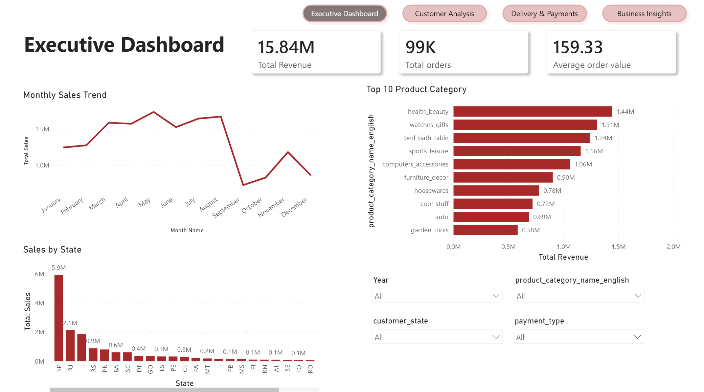
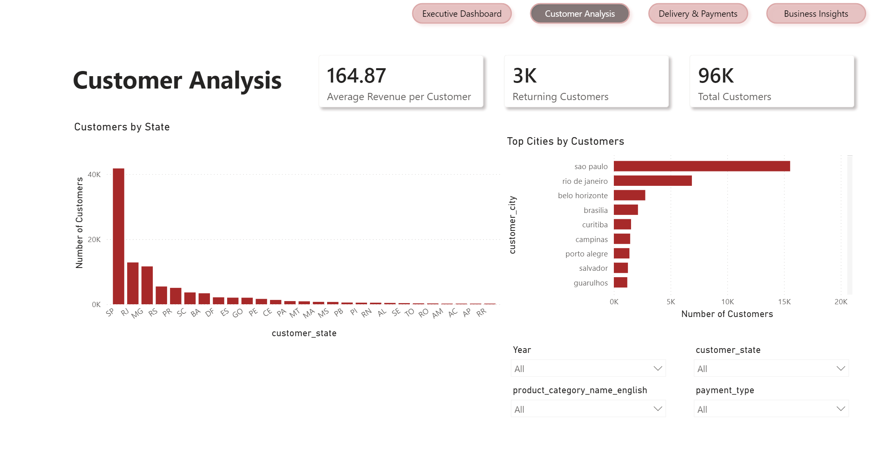
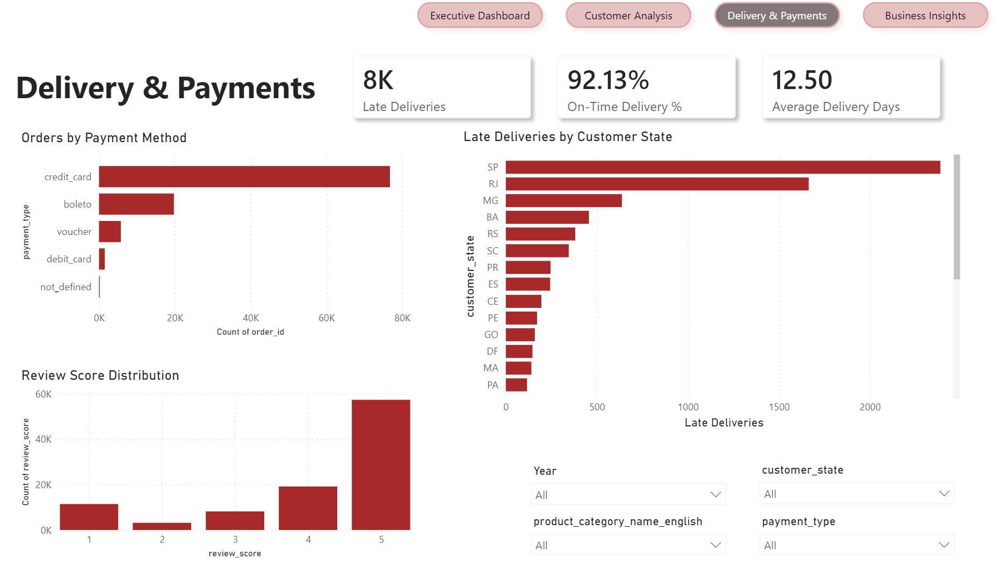
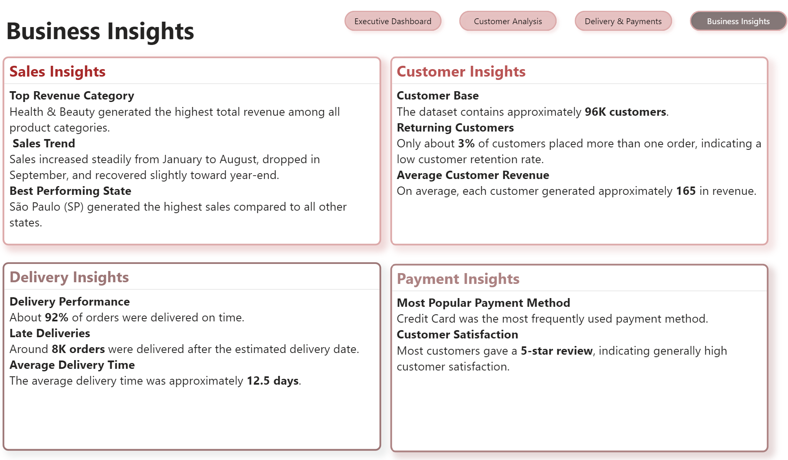
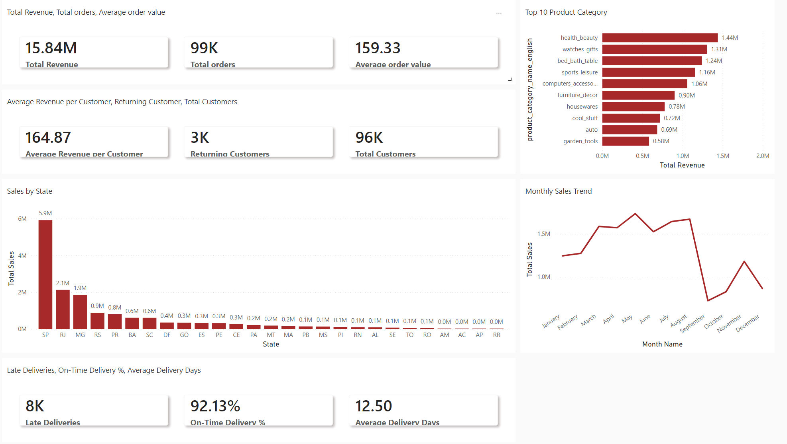

# Brazilian E-Commerce Dashboard | Power BI

## Project Overview

This project analyzes the Brazilian E-Commerce Public Dataset by Olist using Power BI and a Star Schema data model.

The dashboard explores e-commerce performance across sales, customer behavior, delivery efficiency, payment methods, and customer reviews. It was developed as a portfolio project to practice and demonstrate e-commerce data analysis, data modeling, DAX, and interactive dashboard development.

---

## Live Dashboard

🔗 [View Interactive Power BI Dashboard](https://app.powerbi.com/view?r=eyJrIjoiZTFhNGYwMDUtM2YwOS00NGIxLWE2YzEtZGRiNDcyNTk2MmQ2IiwidCI6IjJkMzE5NGUzLTE2NTQtNDZiZC1iYWUyLWFkMzdiYTExYjBhZSIsImMiOjl9&pageName=7e57d7d05f190773d1db)

> Interactive dashboard published using Power BI Publish to web.

---

## Business Understanding

The purpose of this project was to analyze e-commerce business performance and identify meaningful patterns in sales, customers, delivery, payments, and customer satisfaction.

The project was selected to practice working with a real-world multi-table e-commerce dataset and to demonstrate how Power BI can be used to transform raw data into interactive business insights.

---

## Dataset

**Brazilian E-Commerce Public Dataset by Olist**

The dataset contains approximately 100,000 orders from Olist Store in Brazil, covering order information, customers, products, payments, delivery performance, and customer reviews.

The dataset was originally provided by Olist and published publicly through Kaggle.

**Source:** [Brazilian E-Commerce Public Dataset by Olist – Kaggle](https://www.kaggle.com/olistbr/brazilian-ecommerce)

**License:** CC BY-NC-SA 4.0
---

## Data Understanding

The dataset consists of multiple related tables covering different aspects of the e-commerce process, including:

- Customers and customer locations
- Orders and order dates
- Order items and product information
- Sellers
- Payments
- Customer reviews
- Product categories

The dataset was selected because its relational structure provides an opportunity to practice data integration, data modeling, and business analysis using Power BI.

Future analysis could include customer segmentation, seller performance analysis, and more advanced customer behavior analysis.

---

## Tools & Technologies

- Power BI Desktop
- Power Query
- DAX
- Data Modeling
- Star Schema
- Data Visualization

---

## Data Preparation

The data preparation process included:

- Removed unnecessary columns.
- Removed the Geolocation table.
- Renamed columns for consistency.
- Created a dedicated Date table.
- Built relationships between tables.
- Prepared the data model for analysis.

---

## Data Model

The project uses a **Star Schema** consisting of:

- Fact Tables
- Dimension Tables
- Date Table

The model was designed to support sales, customer, delivery, payment, and review analysis.

---

## Analytical Approach

The analysis followed these main steps:

1. **Data Preparation**
   - Reviewed and cleaned the source tables.
   - Removed unnecessary data.
   - Standardized column names.

2. **Data Modeling**
   - Built a Star Schema.
   - Created relationships between fact and dimension tables.
   - Added a dedicated Date table.

3. **DAX Analysis**
   - Created calculated measures for business KPIs.
   - Analyzed sales, customers, delivery performance, and customer behavior.

4. **Data Visualization**
   - Designed interactive Power BI dashboards.
   - Added KPIs, charts, slicers, and navigation buttons.
   - Organized the analysis into multiple dashboard pages.

5. **Business Insights**
   - Identified key sales categories.
   - Analyzed customer distribution and retention.
   - Evaluated delivery performance.
   - Examined payment methods and customer reviews.

---

## DAX Measures

Key measures created for the analysis include:

- Total Revenue
- Total Sales
- Total Orders
- Total Customers
- Average Order Value
- Sales YTD
- Previous Year Sales
- YoY Growth %
- Running Total
- Returning Customers
- Average Revenue per Customer
- Average Delivery Days
- On-Time Delivery %
- Late Deliveries

---

## Dashboard Pages

### Executive Dashboard

Provides an overview of overall e-commerce performance:

- Revenue KPIs
- Monthly Sales Trend
- Top 10 Product Categoty
- Sales by State

### Customer Analysis

Focuses on customer behavior and geographic distribution:

- Customers by State
- Top Cities by Customers
- Returning Customers
- Average Revenue per Customer
- Total Customers

### Delivery & Payments

Analyzes delivery performance, payment methods, and customer reviews:

- Delivery Performance
- Payment Methods
- Review Score Distribution
- Late Deliveries by State

### Business Insights

Summarizes the key findings and business insights identified throughout the analysis.

---

## Key Business Insights

- Health & Beauty generated the highest revenue among product categories.
- São Paulo (SP) recorded the highest sales.
- Credit Card was the most frequently used payment method.
- More than 90% of orders were delivered on time.
- Customer reviews were generally positive, with 5-star ratings being the most common.
- Customer retention was relatively low, with only a small percentage of customers placing more than one order.

---

## Dashboard Preview

### Executive Dashboard

---

## Status

**Completed — Portfolio Project**

---

## Credits

- Dataset provided by Olist and published through Kaggle.
- Dataset license: CC BY-NC-SA 4.0.
- Dashboard design, data preparation, data modeling, DAX measures, and analysis completed by Reema Alturaif.
---

## Author

**Reema Alturaif**
